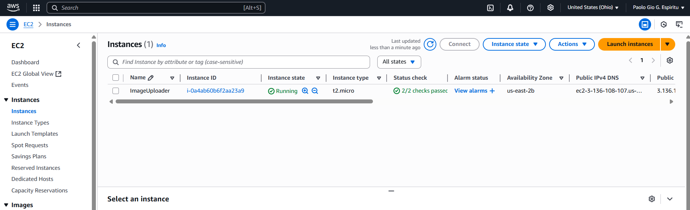

# 📸 Project Screenshots & Descriptions

## 1. Created Image Uploader EC2 Instance  
Successfully launched an EC2 instance that serves as the web server for the image uploader application.  

---

## 2. Connected to EC2 Using PuTTY  
Established an SSH connection to the EC2 instance using PuTTY for remote configuration and deployment.  

---

## 3. Web Server Is Working  
Installed and verified Apache HTTP server functionality by accessing the EC2 instance's public IP.  

---

## 4. Created Image Uploader S3 Bucket  
Provisioned an S3 bucket that will store uploaded image files securely.  

---

## 5. Created IAM Role for EC2  
Defined an IAM role with permissions to allow EC2 instances to interact with S3.  

---

## 6. Attached IAM Role to EC2 Instance  
Linked the IAM role to the EC2 instance to enable secure access to the S3 bucket without using access keys.  

---

## 7. Tested EC2 Access to S3 Bucket  
Verified that the EC2 instance can upload to and retrieve from the configured S3 bucket using AWS CLI.  

---

## 8. Uploaded PHP and HTML Files Using WinSCP & PuTTY  
Deployed application files (PHP & HTML) to the EC2 server via WinSCP and PuTTY.  

---

## 9. Created CloudWatch Logging  
Set up CloudWatch for real-time monitoring and logging of application activity and errors.  

---

## 10. Tested Image Uploader Web App  
Launched the application in a browser and tested the file upload interface.  

---

## 11. Uploaded Successfully in the Web App  
Successfully uploaded an image through the front-end and received a confirmation message.  

---

## 12. Verified Upload in the S3 Bucket  
Confirmed that the uploaded image is stored in the specified S3 bucket.  

---

# ⚙️ Optional: Load Balancer & Auto Scaling Setup

## 13. Created Launch Template  
Defined a launch template to standardize EC2 configurations for auto scaling.  

---

## 14. Created Auto Scaling Group  
Set up an Auto Scaling Group (ASG) to manage EC2 instances based on load or health.  

---

## 15. Created Load Balancer for EC2  
Deployed an Application Load Balancer (ALB) to distribute traffic evenly across instances.  

---

## 16. Created Target Group  
Defined a target group containing EC2 instances that the ALB routes traffic to.  

---

## 17. Attached Target Group to Auto Scaling Group  
Connected the target group with the ASG to automatically manage traffic to new instances.  

---

## 18. Auto Scaling Functioning  
Validated the auto scaling functionality by observing EC2 instances scale based on traffic or health checks.  

